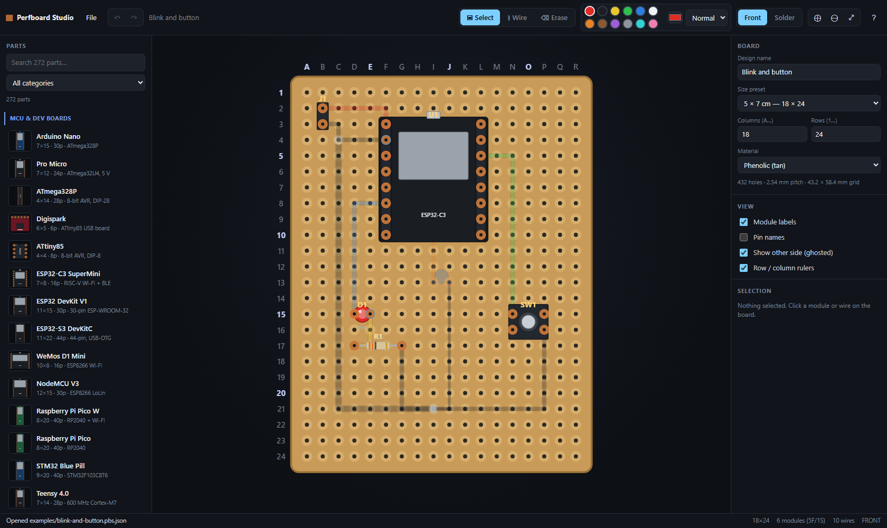
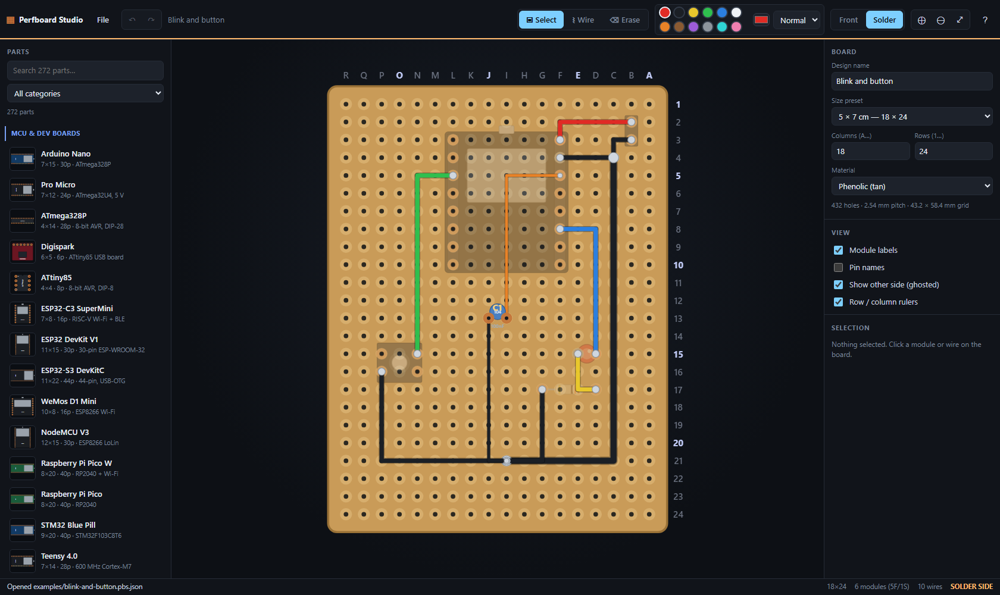

# Perfboard Studio

Design perfboard layouts in the browser. Place modules on a configurable hole
grid, route coloured wires, flip between the component and solder side, and save
your work as a JSON file you can reopen later.

No build step, no dependencies, no backend — a static site that deploys to
Vercel as-is.



---

## Features

- **Configurable board.** Ten physical presets (2×8 cm through 12×18 cm) or any
  custom grid up to 120 × 120 holes. Columns are lettered `A…Z, AA…`, rows are
  numbered from 1, so every hole has a name like `F12`.
- **543 parts out of the box** across 11 categories — dev boards, DIP ICs,
  regulators, sensors, displays, passives (the whole E12 resistor and capacitor
  series, with colour bands computed from the value), discretes, connectors and
  IC sockets, radios, motor drivers.
- **Front / solder side.** Press <kbd>Tab</kbd> to flip. The solder view mirrors
  the board so wiring underneath reads correctly, while text stays upright. Parts
  and wires each live on a side; the other side shows ghosted.
- **Coloured wiring.** Twelve standard wire colours plus a custom picker, three
  gauges, multi-segment routing along the hole grid.
- **Undo/redo** on everything, plus autosave to `localStorage` so a stray reload
  does not cost you the layout.
- **Save and open** `.pbs.json` designs. Files embed the definitions they use, so
  an old design still opens correctly even if the catalog has since changed.
- **Export** to SVG, PNG, or a tab-separated bill of materials.
- **Admin-friendly catalog.** Every part is one JSON file. Edit it, re-run the
  generator, reload the page, done.



*The solder side: rulers reverse (R→A), row numbers move right, solder-side
wiring shows in full colour and the front-side parts are ghosted.*

---

## Running it locally

The app is plain ES modules and `fetch`, so it needs to be **served over HTTP** —
opening `index.html` from the filesystem will not work (the browser blocks the
module and JSON requests).

```bash
python -m http.server 5173     # then open http://localhost:5173
```

or, if you would rather use Node:

```bash
npx serve -l 5173 .
```

Both are wired up as `npm run dev` and `npm run dev:node`. Neither installs
anything — `package.json` has no dependencies.

---

## Deploying to Vercel

1. Push the repo to GitHub.
2. In Vercel, **Add New → Project**, import the repo.
3. Framework preset: **Other**. Leave the build command empty and the output
   directory as the repo root.
4. Deploy.

`vercel.json` sets the security headers and marks `modules/` and `src/` as
`must-revalidate`, so editing a part JSON and redeploying takes effect
immediately rather than being served from a stale edge cache.

---

## Using it

| | |
|---|---|
| Place a part | Click it in the left palette, then click a hole. <kbd>R</kbd> rotates, <kbd>Esc</kbd> cancels. |
| Move a part | Drag it. Arrow keys nudge one hole at a time. |
| Draw a wire | <kbd>W</kbd>, click holes to route, double-click or <kbd>Enter</kbd> to finish. <kbd>Backspace</kbd> removes the last bend. |
| Flip the board | <kbd>Tab</kbd> |
| Move a part to the other side | Select it, press <kbd>F</kbd> |
| Delete | Select and press <kbd>Del</kbd>, or use the erase tool (<kbd>E</kbd>) |
| Pan / zoom | Middle-drag or <kbd>Space</kbd>+drag; scroll wheel to zoom, <kbd>0</kbd> to fit |

Press <kbd>F1</kbd> in the app for the full list.

There is an example design to poke at:
`http://localhost:5173/?design=examples/blink-and-button.pbs.json`
(add `&side=solder` to land on the solder view).

---

## Repository layout

```
index.html                  the app shell
src/
  main.js                   entry point; wires the pieces together
  core/
    board.js                presets, hole naming, mirroring, extents
    geometry.js             placement, rotation, resize, hit-test maths
    store.js                document state + undo/redo
    catalog.js              loads and validates modules/
  render/
    renderer.js             the board SVG (geometry layer + label layer)
    shapes.js               shape primitives -> SVG
    preview.js              palette / inspector thumbnails
  ui/
    toolbar.js  palette.js  inspector.js  canvas.js  shortcuts.js
  io/
    project.js              save / open .pbs.json
    export.js               SVG, PNG, bill of materials
  styles/
    base.css                tokens and primitive controls
    app.css                 application shell
modules/
  index.json                the catalog manifest — categories and file list
  catalog.json              generated: every part inlined, loaded in one request
  _schema/module.schema.json
  <category>/<id>.json      one file per part (the source of truth)
tools/
  generate_catalog.py       (re)builds the part families
  catalog_lib.py            package factories used by the generator
  validate_catalog.py       format + invariant checks
  run_browser_tests.py      runs the two suites headlessly
  selftest.html             unit tests
  integration.html          renderer / catalog / example tests
examples/
docs/MODULE_FORMAT.md       how to author a part
```

---

## Adding parts

Each part is one JSON file. Geometry is in **hole units** (1 unit = one 2.54 mm
pitch), with `(0,0)` at the hole under pin 1:

```json
{
  "$schema": "../_schema/module.schema.json",
  "id": "my-widget",
  "name": "My Widget",
  "subtitle": "does a thing",
  "category": "misc",
  "tags": ["widget"],
  "designator": "U",
  "footprint": { "cols": 2, "rows": 1 },
  "pins": [
    { "col": 0, "row": 0, "name": "IN",  "number": 1, "type": "in" },
    { "col": 1, "row": 0, "name": "GND", "number": 2, "type": "gnd" }
  ],
  "body": { "x": -0.4, "y": -0.4, "w": 1.8, "h": 0.8, "fill": "#2a3038", "stroke": "#4a525c" },
  "label": { "text": "W1", "size": 0.35 }
}
```

Save it as `modules/misc/my-widget.json`, register it, and check it:

```bash
python tools/generate_catalog.py --index    # rewrite index.json + catalog.json
python tools/validate_catalog.py            # format + invariant checks
```

Keep the `$schema` line — VS Code will then autocomplete and validate the file
as you type.

`--index` is needed because the app loads `modules/catalog.json`, a generated
bundle of every part, rather than fetching 543 small files at boot. The
per-category files stay the source of truth; the validator fails if the bundle
drifts from them, and the app falls back to per-file fetching if it is missing.

For whole families (resistor values, LED colours, DIP packages) add entries to
the relevant `build_*()` function in `tools/generate_catalog.py`, which has
factories for DIP, TO-92, TO-220, dev boards, breakouts and axial passives, then
run `python tools/generate_catalog.py`. **That command overwrites the files it
owns**, so put bulk changes in the generator rather than in the JSON.

Full reference: [`docs/MODULE_FORMAT.md`](docs/MODULE_FORMAT.md).

### A note on footprint accuracy

Pinouts for the common ICs and dev boards were entered from their datasheets, but
board *outlines* and header spacings for some third-party modules are close
approximations rather than measured values. If a part does not line up with the
one on your bench, the fix is a one-line edit to its JSON — that is the whole
point of the format. Corrections are welcome.

---

## Tests

There is no Node dependency, so the tests are HTML pages that import the real ES
modules and run in a real browser:

```bash
python tools/validate_catalog.py       # 543 modules, format + rotation invariant
python tools/run_browser_tests.py      # 61 unit + 28 integration checks
```

The runner finds Chrome, Edge or Chromium automatically; pass `--browser <path>`
if it cannot. You can also just open `tools/selftest.html` and
`tools/integration.html` in any browser with the dev server running.

The integration suite is the one that matters most. It loads the real catalog and
asserts, among other things, that **every part's copper pads land exactly on the
hole centres they claim — at all four rotations, on both sides of the board**,
measured from the actual rendered SVG rather than from the maths in isolation.
It also renders all 543 parts at every rotation, and checks the shipped example
has no electrically dangling wire ends.

---

## Design notes

**Why no framework or bundler?** The catalog is the extensibility point, and it
works best as plain JSON fetched at runtime — a bundler invites `import`-ing the
part files, which would drag the whole catalog into the JS build graph. Skipping
the toolchain also means zero dependencies to audit and a genuinely trivial
Vercel deploy. The code is still fully modular; it just uses the browser's own
module system.

**Why bundle the catalog then?** Above roughly a hundred parts, one HTTP request
per part dominates start-up. `modules/catalog.json` is a concatenation, not a
build product: the same JSON, in one file, produced by the same script that
writes the parts. Nothing about the format or the authoring loop changes, and the
loader still works without it.

**Why mirror the board instead of the artwork?** The solder view applies one
horizontal mirror to the whole geometry layer, so wire routing under the board is
physically correct without any per-item special cases. Text would become
unreadable under that mirror, so the renderer keeps all text in a second,
unmirrored layer and computes its absolute position itself.

**Why store a definition snapshot in saved files?** So a design opened in two
years still renders, even if a part was renamed or removed. Definitions from the
file are only adopted for ids the live catalog does not have, so editing a part
JSON still propagates to existing designs.

---

## Licence

MIT — see [LICENSE](LICENSE).
